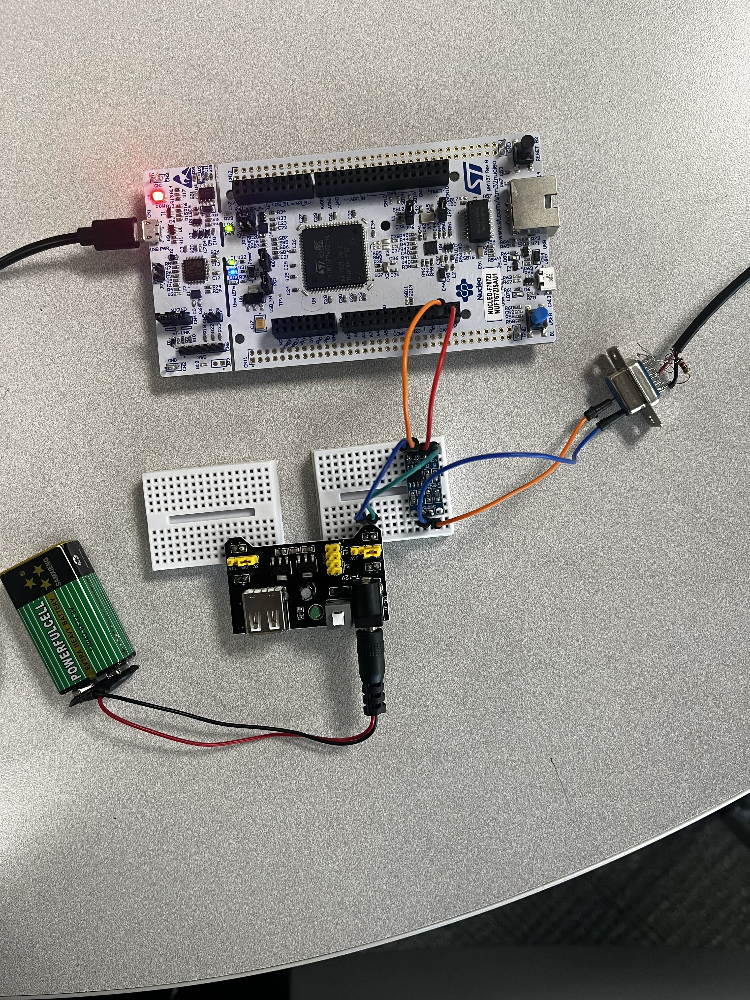
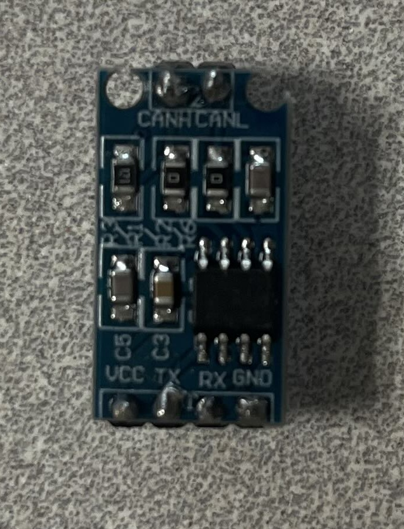
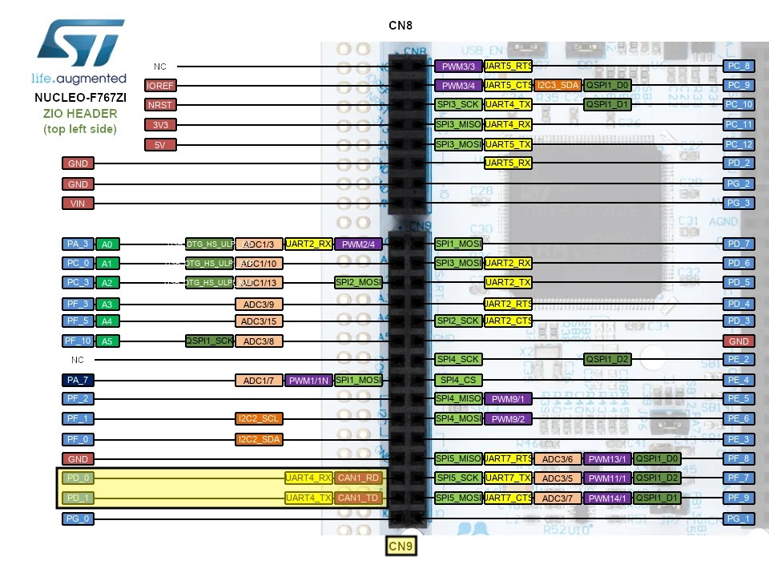
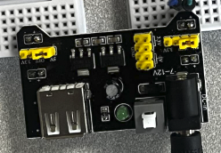
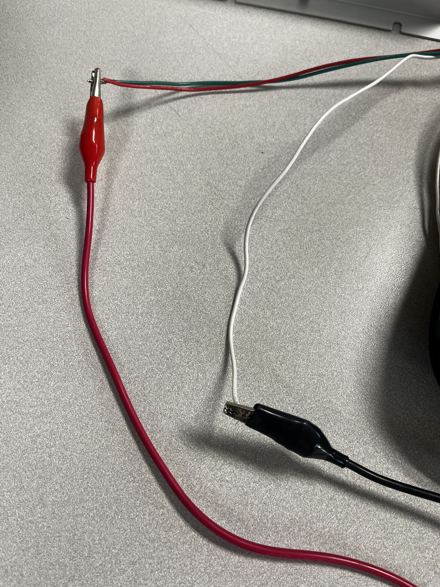
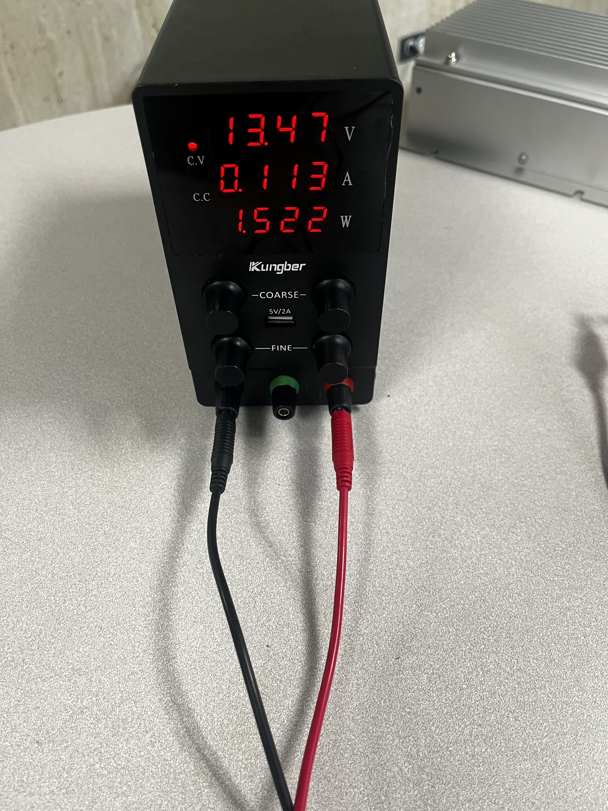
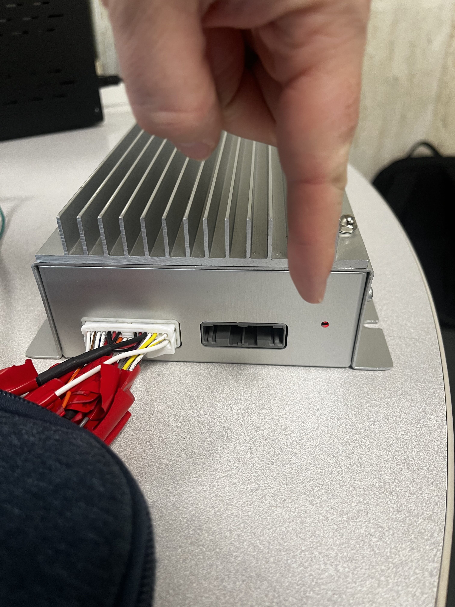

# Setting up the development board
 NOTE: These instructions are for connecting to the BMS but can be adapted for other use cases 

    
Completed Wiring Example

    </img>

## Preparing the STM32 Dev board and CAN Transceiver
##### The dev board will be powered by the USB port for testing purposes

    
CAN Transceiver Reference Image

    </img>

1. Connect the CAN transceiver to the stm32
    
    * The TX pin on the transveiver goes to the PD_1 pin of the Nucleo
    * The RX pin on the transceiver goes to the PD_0 pin of the Nucleo
    

        
Nucleo Pinout Reference Image

        </img>
    

2. Connect the CAN transciever to Power using the power board

    * Ensure that the yellow jumper are set to output 5v on the board
    

        
Power Board Reference Image

        
    

## Preparing the BMS

1. Connect the Solid Red and Solid Green wires from the BMS Wire Harness to the Red wire of the voltage supply 
2. Connect the Solid White Wire from the BMS to the Black wire of the voltage supply
    

        
Image of the connection 

    * The wires from the BMS Wire Harness should be stripped already to allow for easy connections to be made

        </img>
    

    

        
Power Supply Example Settings

    * The voltage supply should be set around 12 Volts and 0.1-0.25 Amps
        

    

3. Ensure that the Wire Harness is connected to thie BMS
    
    * After Successful connection with the voltage supply properly set a red light should light up on the BMS
        

            
BMS Red light running

            
        

## Connecting the BMS to the CAN Transceiver
1. Locate the Serial Port that is soldered to the BMS Wiring Harness
    
    * This is the CAN connector

2. Use a wire to connect the CANH Pin on the transceiver to the hole that the Red wire on the back of the CAN connector is soldered to

3. Use another wire to connect the CANL Pin on the transceiver to the hole that the Black wire on the back of the CAN connector is soldered to